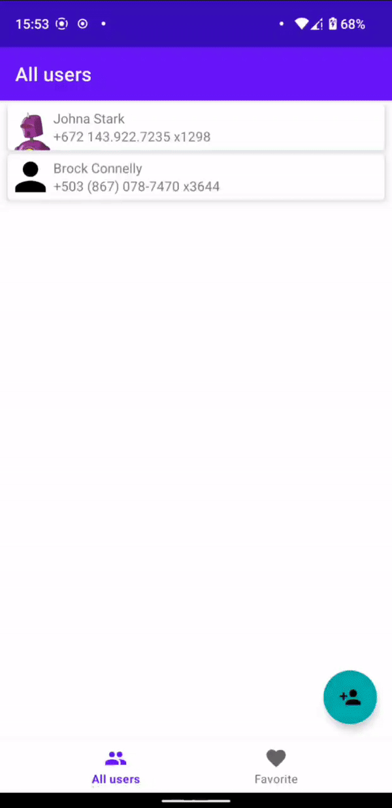

# Contacts

## Що реалізовано

- Завантаження даних про користувачів
- Збереження обраних даних до локальної бази
- Детальний перегляд даних
- Збереження фотографій для офлайн перегляду

## Що не встиг реалізувати

- Обробка смерті процесу на екрані всіх користувачів (збереження даних до бандлу)
- DiffUtil для списку користувачів
- Обробка (відображення) помилок

## Демонстрація

 

  

## Завантажити

[дебаг_apk](description/contacts-debug.apk)
 
